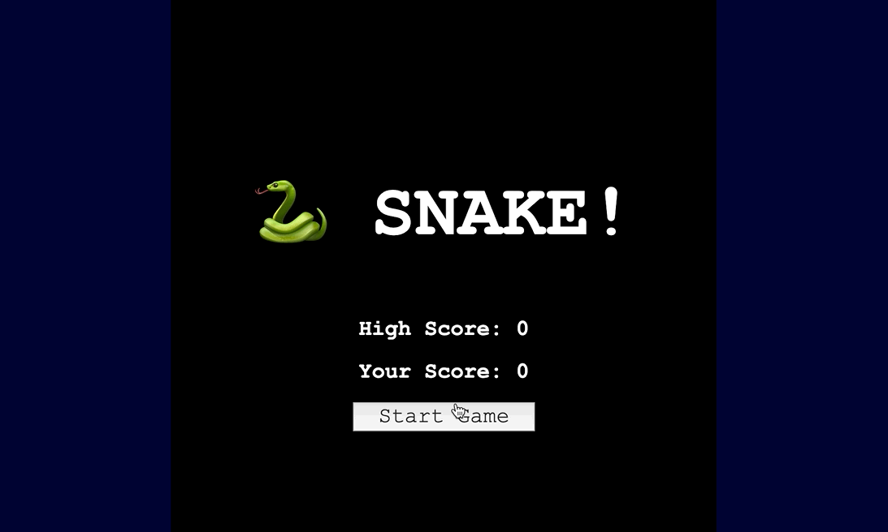

# Make a Snake

---?code=code/boilerplate.html&lang=html

@snap[north span-100]
#### Boilerplate
@snapend

@[1](This just tells the browser that this is an HTML document.)
@[2,11](Most HTML tags open and close.  This tag contains all of our HTML code.)
@[2,11](The lang="en" part tells the browser the text will be in English.  The lang is considered an attribute and the "en" is its value.)
@[2-3,7-11](Inside the html tag, there is a head and a body.)
@[2-3,7-11](HTML tags are generally nested inside one another. We use the words "parent" and "children", and "siblings" to refer to tags inside of other tags.)
@[3-7](The head contains data about the site.  You can see the child tags have more attributes and values.)
@[4-5](Here we are telling the browser to expect UTF-8 characters, and to make the page's width equal to the width of the device.)
@[6](Whatever is inside the title tag will display in the browser tab.)
@[8-10](The body will contain anything we want to display inside the browser window.)
@[9](This is an HTML Comment.  It won't display in the browser.  It's a way to write notes to yourself, or to temporarily disable certain parts of your code. However, whatever you write here is NOT a secret.)

---?code=code/title_headings.html&lang=html

@snap[north span-100]
#### Title and Headings
@snapend

@[6](Whatever you put in this tag displays in the browser tab.)
@[9-11](These are heading tags, they go from h1 to h6.  They are used to communicate the importance of different bits of text to the user.)

---

2 User Experiences

---?code=code/sections.html&lang=html

@snap[north span-100]
#### 2 User Experiences
@snapend

@[8-15](We will give each section a unique id attribute, so we can apply styles and interactivity later.)

---?code=code/welcome_screen.html&lang=html

@snap[north span-100]
#### Welcome Screen HTML
@snapend

@[9-10,21-22](First, let's group all the content together in its own div, with an id of "overlay-content".)

