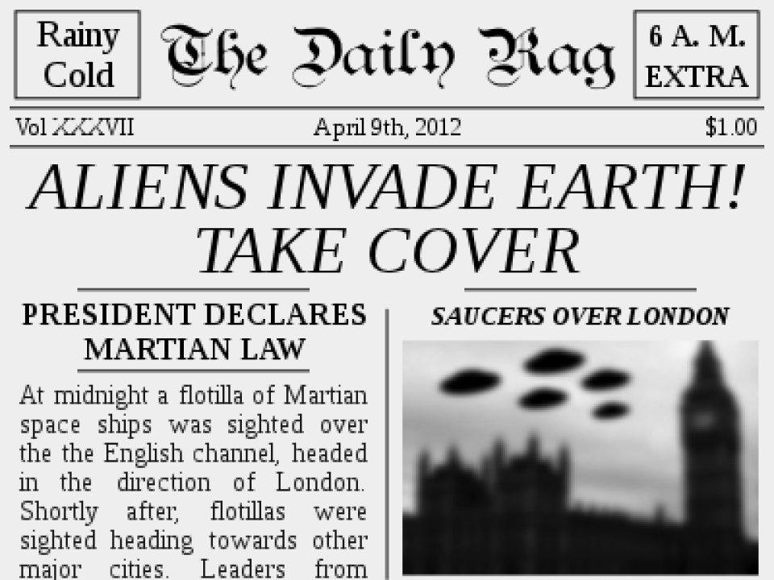
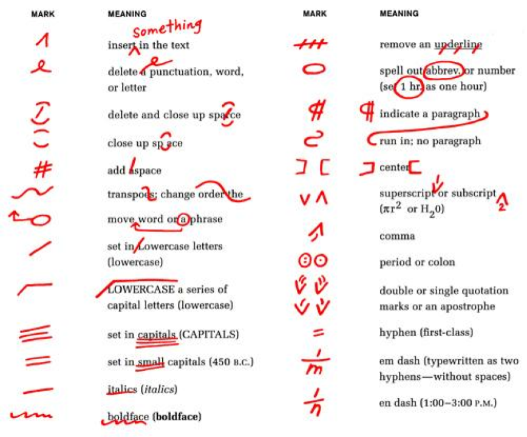
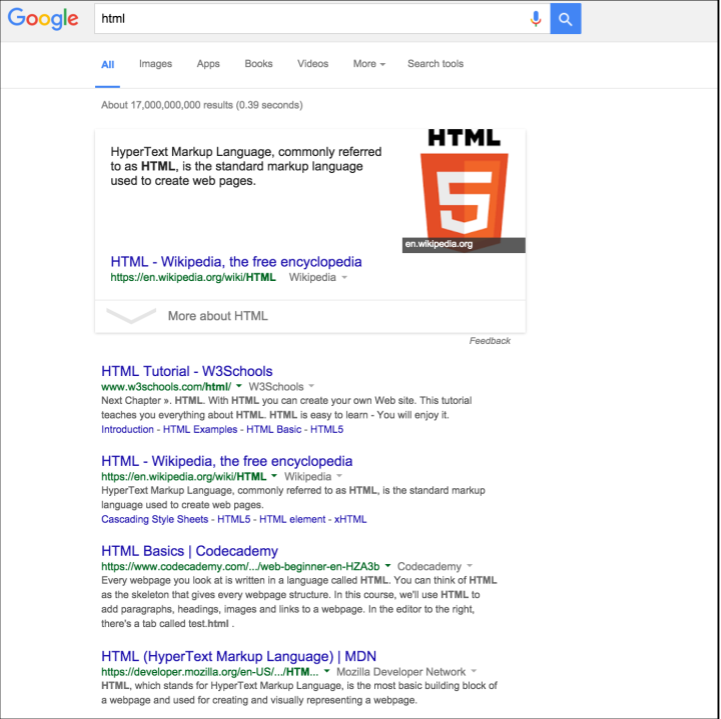
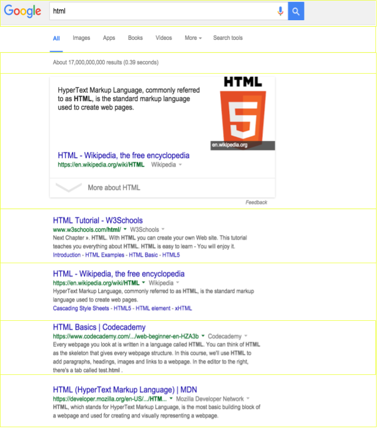

# Make a Snake 🐍

* [Get Started With Repl.it](https://repl.it/@andyweiss1982/wyntro2020)
* [Final Result](https://wyncode.github.io/wyntro2020)

---

## Hyper
## Text
## Markup
## Language

---
@snap[north span-100]
#### HTML
@snapend

Aliens invade earth

take cover

Justin Bieber!

---

@snap[north span-100]
#### HTML
@snapend

@snap[west span-50]

@snapend

@snap[east span-40]

@snapend

---

@snap[north span-100]
#### HTML
@snapend

@snap[midpoint span-60]

@snapend

---

@snap[north span-100]
#### HTML
@snapend

@snap[midpoint span-50]

@snapend

---

@snap[north span-100]
#### HTML
@snapend

@snap[midpoint span-50]

@snapend

---

#### Anatomy of an HTML element

```html
<tagname attribute="value" otherattribute="othervalue">
  Contents go inside
</tagname>
```

---?code=code/boilerplate.html&lang=html

@snap[north span-100]
#### Boilerplate
@snapend

@[1](This just tells the browser that this is an HTML document.)
@[2,11](Most HTML tags open and close.  This tag contains all of our HTML code.)
@[2,11](The lang="en" part tells the browser the text will be in English.  The lang is considered an attribute and the "en" is its value.)
@[2-3,7-11](Inside the html tag, there is a head and a body.)
@[2-3,7-11](HTML tags are generally nested inside one another. We use the words "parent" and "children", and "siblings" to refer to tags inside of other tags.)
@[3-7](The head contains data about the site.  You can see the child tags have more attributes and values.)
@[4-5](Here we are telling the browser to expect UTF-8 characters, and to make the page's width equal to the width of the device.)
@[6](Whatever is inside the title tag will display in the browser tab.)
@[8-10](The body will contain anything we want to display inside the browser window.)
@[9](This is an HTML Comment.  It won't display in the browser.  It's a way to write notes to yourself, or to temporarily disable certain parts of your code. However, whatever you write here is NOT a secret.)

---?code=code/title_headings.html&lang=html

@snap[north span-100]
#### Title and Headings
@snapend

@[6](Whatever you put in this tag displays in the browser tab.)
@[9-11](These are heading tags, they go from h1 to h6.  They are used to communicate the importance of different bits of text to the user.)

---?code=code/anchors_images.html&lang=html

@snap[north span-100]
#### Anchors and Images
@snapend

@[9-18](Different tags produce different elements in the browser.)
@[9-14](The a -- or "anchor" -- tag, makes what we commonly refer to as a link.)
@[9-14](The text in between the opening and closing tag is what text displays in the browser.  The href attribute specifies where the browser goes if the link is clicked.  The title attribute displays a tooltip when the user hovers over the link.)
@[15-18](Img tags are self closing, since there is no text inside.  The src attribute tells us where the image lives on the internet.  The alt attribute is a description of the image for people who use screen readers.)

---?code=code/divs_spans.html&lang=html

@snap[north span-100]
#### Divs and Spans
@snapend

@[9-16](Divs and spans are ways to organize your HTML.)
@[9,10](By default, divs stack vertically on the page.  This is called block display.)
@[12-15](By default, spans stack horizontally.  This is called inline display.)
@[9-16](We can label elements with ids and classes.  This doesn't do anything just yet, but we will use it  later to apply styles and interactivity using CSS and JavaScript.)
@[9,10](Ids are for elements that occur only once inside the HTML document.)
@[12-15](Whereas classes are for elements that are a member of a group.)

---

#### 2 User Experiences


---?code=code/sections.html&lang=html

@snap[north span-100]
#### 2 User Experiences
@snapend

@[8-15](Similar to divs, sections are a way of breaking up our content.  We will give each section a unique id attribute, so we can apply styles and interactivity later.)

---?code=code/overlay.html&lang=html

@snap[north span-100]
#### Welcome Screen HTML
@snapend

@[9-10,23-24](First, let's group all the content together in its own div, with an id of "overlay-content".)
@[11-19](Here we are communicating the most important text on the page with an h1, and two text snippets of secondary importance with h2 tags.)
@[11,15,18](Certain bits of text have unique ids because we intend to manipulate their text content later.)
@[20-22](The start button has an onclick attribute.  We will have to define what "startGame()" means later.)

---?code=code/tiles.html&lang=html

@snap[north span-100]
#### Game HTML
@snapend

@[26-125](We are making 100 game tiles we will ultimately display in a 10x10 grid.)
@[26-125](Each one has the same class, "tile", as well as a special attribute called data-position with a unique, numeric value.)  
@[26-125](Attributes that start with the data prefix are -- not surprisingly -- for storing data about that HTML element that might be used elsewhere.)
@[26-125](Finally, we are putting some text inside each one just so we can see some output on the screen for now.)

---?code=code/css_js.html&lang=html

@snap[north span-100]
#### Link in CSS and JS
@snapend

@[7](This link tag pulls in styles we will write in a file called styles.css.  It goes in the head of our HTML document.)
@[128](This script tag pulls in the JavaScript we will write in a file called game.js.  It goes at the very bottom of the body tag.)

---?code=index.html&lang=html

@snap[north span-100]
### Get the HTML
@snapend

---

## Cascading
## Style
## Sheets

---

#### Anatomy of a style declaration

```css
target {
  property: value;
}
```

---?code=code/anatomy.css&lang=css

@snap[north span-100]
#### Anatomy of a style declaration
@snapend

@[1-4](Targets all text)
@[6-9](Targets all h2 elements)
@[11-17](Targets anything with a class of "tile")
@[19-22](Targets the element with an id of "overlay-title")
@[24-27](Targets anything with an onclick attribute)
@[29-32](Targets anything with a data-position attribute of "3")
@[34-37](Targets anything with a class of "tile" and a data-position attribute of "7")
@[39-42](Targets all spans that don't have an id of "high-score")
@[44-47](Targets any buttons that are direct children of the element with an id of "overlay-content")
@[49-54](Targets the body only when the screen is less that 700px wide)

---?code=code/position.css&lang=css

@snap[north span-100]
#### Position
@snapend

@[1-5](Fixed position places an element in its own layer.)
@[1-5](The top, bottom, left or right properties are relative to the entire browser window.)
@[7-15](Relative and absolute positioning work together.)
@[7-15](The absolute element is taken out of the normal document flow, and placed relative to the nearest relative parent -- so tile 2 is in the upper right corner of the game.)

---?code=code/units.css&lang=css

@snap[north span-100]
#### Units
@snapend

@[1-3](Pixels may display differently across different devices.)
@[5-7](rems are multiples of the base font size.)
@[9-17](vw is viewport width, vh is viewport height, vmin is whichever is smaller, vmax is whichever is bigger -- these are used to create responsive layouts.)

---

#### Game Time


---?code=code/body.css&lang=css

@snap[north span-100]
#### Body
@snapend

@[1-3](Let's give everything the same font.)
@[5-7](Let's give the body white text on a blue background.)
@[8-10](Let's make it take up the whole screen with no margin.)
@[11-13](This is a good way to center things horizontally and vertically.)

---?code=code/overlay.css&lang=css

@snap[north span-100]
#### Overlay
@snapend

@[15-22](Let's focus specifically on the welcome screen.)
@[15-18](This places the overlay in its own layer that takes up the full screen.)
@[19](This makes the background 80% opaque black.)
@[20-22](This attempts to center all of the content.)
@[24-30](Let's make the title a little bigger and center the text.)
@[32-36](Let's make the button a little bigger and make it look clickable.)
@[38-48](Finally, we need a way to hide the welcome screen when the user starts the game.)

---

Right click, "inspect", add class="hidden"


---?code=code/game.css&lang=css

@snap[north span-100]
#### Game
@snapend

@[42-46](Let's make the game board a 700px x 700px black square.  Making the color transparent will hide the tile number labels.)
@[47-50](This divides the game board into a 10x10 grid of equally sized squares.)
@[52-57](If the screen is smaller than 700px x 700px, shrink the game board accordingly.)
@[59-62](This will make the food tile a red circle.)
@[64-66](Any tile with a data-snake attribute will display green.  This is how we will draw the snake on the board.)

---

Right click, "inspect", add "food" to class


---

Inspect element, add data-snake attribute


---?code=style.css&lang=css

@snap[north span-100]
### Get the CSS
@snapend

---

# JavaScript

---

Right click, "inspect", click "console"


---

JavaScript is the only programming language that runs in a web browser.


---?code=code/data_types.js&lang=js

@snap[north span-100]
#### JS Data Types
@snapend

@[1-3](typeof is a function that outputs the type of its input.)
@[5-7](Working with like data types does what you probably expect, but weird things can happen when you mix and match.)
@[9](We can check if two things are equal with the === operator.)
@[10](Two values that are similar, but different datatypes, are not strictly equal in JavaScript.)
@[12-13](true and false are a different datatype alltogether -- "boolean".)
@[15-19](We can attempt to convert values from one datatype into another -- when it makes sense to do so.  Each of these is a function because it takes input and returns output.)
@[20-21](Some values are considered "truthy" and others are considered "falsey".)
@[23](Converting a value from one data type to another can make it pass the strict equality test.)

---?code=code/math.js&lang=js

@snap[north span-100]
#### JS Math
@snapend

@[1-4](These all do pretty much what you'd expect.)
@[5](** is for exponents.)
@[6](% is for remainders.)
@[8](Returns a random number between 0 and 1.)
@[10-11](These round numbers the way you'd expect.)
@[12-13](Or, if you want more granular control.)

---?code=code/variables.js&lang=js

@snap[north span-100]
#### JS Variables
@snapend

@[1](The let keyword initializes a variable and lets me assign a value to it.)
@[2](Variables that are initialized in this way can be reassigned new values.)
@[3](I can use the console.log function to "read out" the value of a variable.)
@[4-5](I can assign any value I want.)
@[7-8](Sometimes, we need to initialize a variable without a value.  In this case, the value defaults to undefined.)
@[9-10](But I can still assign -- or reassign -- the value later.)
@[12-13](The const keyword initializes a constant.  They store values like variables, but they cannot be changed or reassigned later.)

---?code=code/control_flow.js&lang=js

@snap[north span-100]
#### JS Control Flow
@snapend

@[1](The Math.random() function returns a value between 0 and 1.)
@[3-7](We can use control flow to do one thing -- or something else -- depending on the value of the random number.)
@[9](And since we stored it in a constant, we can use it again.)
@[9](We can use backticks, the dollar sign, and curly braces to interpolate a variable into a string.)

---?code=code/functions.js&lang=js

@snap[north span-100]
#### JS Functions
@snapend

@[1-11](Sometimes, we want to store an entire series of steps so we can reuse those steps.)
@[1-11](We use the function keyword, a name for the function, then parentheses -- if there is any input to the function, it would go here -- and then curly braces to wrap the body of the function.)
@[13](We call -- or invoke -- the function by saying its name followed by parentheses.)
@[13-15](This allows us to write the function once and resuse it as many times as we want.)
@[17](We can even set it on a timer to run every 1000 milliseconds.)
@[18](And cancel the timer whenever we want.)
@[2](Notice we are reassigning this const every time the function runs.  Consts and lets initialized inside of functions only exists inside of that function.)

---?code=code/parameters.js&lang=js

@snap[north span-100]
#### JS Parameters
@snapend

@[1-3](Functions can also accept input, known as parameters.)
@[1](This function accepts a single parameter, which we call the "person".  The name is arbitrary, we could call it anything we like.)
@[2](Inside the function body, we use the parameter like we would a constant.)
@[5-6](We can pass different parameters to the greet function to see what happens.)
@[7](Can you guess what will happen here?)

---?code=code/arrays.js&lang=js

@snap[north span-100]
#### JS Arrays
@snapend

@[1](Arrays are lists that contain other data types.  This is an array of strings.)
@[3-5](We can access items inside the array with bracket notation -- it starts counting from 0.)
@[7-13](We can iterate over each member of the array by passing it an anonymous function with a single parameter.)

---?code=code/random_family.js&lang=js

@snap[north span-100]
#### Random Item inside Array
@snapend

@[1-3](We can use the length property to tell us how many items are in an array.)
@[5-9](This function will greet a random family member each time it's called.  Let's see how it works.)
@[6](A random number from 0 to 1, multiplied by 3, rounded down.)
@[7-8](We access the array at the given position -- and greet them.)
@[11](We can set it up to greet a random person once a second.)
@[12](And then we can turn the timer off.)

---?code=code/objects.js&lang=js

@snap[north span-100]
#### JS Objects
@snapend

@[1-5](Like arrays, objects hold other data types.)
@[1-5](The words on the left are called keys, the ones on the right are called values.)
@[7-8](We can access data inside of an object using dot notation.)
@[10-11](And also update data inside of an object.)
@[13-14](We can add new keys to existing objects.)
@[16-17](As well as remove keys altogether.)

---?code=code/document.js&lang=js

@snap[north span-100]
#### Document Object Model
@snapend

@[1-2](If you just type "document" in the console, you get a JavaScript representation of the entire HTML document, known as the DOM.)
@[4-5](We can query the DOM to find a single element that matches certain criteria -- in this case, the element with an id of "overlay".)
@[7-8](Or we can query the DOM to find an array of elements that match our criteria -- in this case, any element with a class of "tile".)
@[10-13](Finally, we can listen for events the user does in the document.  This logs to the console each key the user types on the document.)

---?code=code/dom_query.js&lang=js

@snap[north span-100]
#### DOM Manipulation
@snapend

@[1](JavaScript can read through the webpack, find the element with an id of "your-score", and store it in a constant.)
@[3](We can log it to the console to make sure the first line worked as expected.)
@[5](Now we can programatically manipulate its textContent to give ourselves whatever score we want!)
@[7-9](Now we can find the overlay and store it in a constant.)
@[11](And we can programatically add class="hidden" to the overlay.)

---?code=code/start_game.js&lang=js

@snap[north span-100]
#### Start Game Function
@snapend

@[1-5](Remember the onclick attribute of the button?  Now's its time to shine.)
@[1](This constant declaration is made outside the function because we will want to use it in more than one place.)

---

### Short Term Goals:

* Place the food on a random tile on the board
* Place the snake's head on a random tile of the board

---

### Medium Term Goals:

* Make the snake's head move in response to user interaction
* Make the snake grow when the head reaches the food

---

### Long Term Goals
* End the game when the snake runs into itself
* Make it possible to play again

---?code=code/random_food.js&lang=js

@snap[north span-100]
#### Random Food
@snapend

@[1-5](querySelectorAll('.tile') returns an array of all the elements with a class of "tile".)
@[7-11](This stores a random tile in the constant foodTile.)
@[13-14](This adds the class of food to that random tile.)

---?code=code/random_head.js&lang=js

@snap[north span-100]
#### Random Snake Head
@snapend

@[1-5](This forms an array of the 99 tiles that are not the food tile.)
@[7-8](This selects a random eligible tile and designates it as the snake's head.)
@[10-14](Every HTML element has a dataset. It's an object of all the data-attributes on the the element.)
@[16-20](We can manipulate this object to display the snake on the screen.  Notice all the data is converted into strings.)

---?code=code/short_term.js&lang=js

@snap[north span-100]
#### ~~Short Term Goals~~
@snapend

@[2](Use let to initialize the snakeLength because we know it will change over time.)
@[7-9](Make a random tile the food tile.)
@[11-13](Make a random not-food tile the head tile.)

---

### Short Term Goals:

* ~~Place the food on a random tile on the board~~
* ~~Place the snake's head on a random tile of the board~~

---

### Medium Term Goals:

* Make the snake's head move in response to user interaction
* Make the snake grow when the head reaches the food

---?code=code/slither.js&lang=js

@snap[north span-100]
#### Snake Slither 1
@snapend

@[3](The intial direction will random -- either up, down, left or right.)
@[4](The snakeSlither variable starts off undefined, we will assign it inside of the startGame function.)
@[6-8](For now our move function doesn't actually move anything.  It just logs to the console which direction the snake wants to move in.)
@[21](At the bottom of the startGame function, we set a timer so that the snake tries to "move" once every 400 milliseconds.)
@[24-29](Finally, we can listen for when the user presses one of the arrow keys and change the direction accordingly.)

---?code=code/move.js&lang=js

@snap[north span-100]
#### Snake Slither 2
@snapend

@[6-8](Let's find current head and the number of its position.)
@[9-20](Depending on the direction, let's figure out what the new position should be.)
@[21-23](Let's remove the data-snake attribute from the old head, find the new head, and assign it a data-snake attribute of "1".)

---

```
Uncaught TypeError: Cannot read property 'dataset' of null
```

## 🤔

It works until it doesn't...

---?code=code/sides.js&lang=js

@snap[north span-100]
#### Snake Slither 3
@snapend

@[11](-5 + 100 = 95.  If we are in the top row and go up, come out the bottom.)
@[15](105 - 100 = 5.  If we are in the bottom row and go down, come out the top.)
@[19](40 + 10 = 50.  If we are on the left side and go left, come out the right.)
@[23](41 - 10 = 31.  If we are on the right side and go right, come out the left.)

---

### Medium Term Goals:

* ~~Make the snake's head move in response to user interaction~~
* Make the snake grow when the head reaches the food

---?code=code/grow.js&lang=js

@snap[north span-100]
#### Snake Grow
@snapend

@[25-26](Let's first find the foodTile and the number of its position.)
@[27,33](If the headPosition is on top of the food, we want to: 1. Move the foodTile somewhere else,  2. Increase the length of the snake)
@[28-31](Move the foodTile somewhere else -- that's not currently part of the snake.)
@[32](Increase the length of the snake.  Now that the snake is potentially longer than 1 tile long, we have to consider what to do with each tile individually.)
@[34](First, let's find all the tiles with a data-snake attribute.  Right now there's only one, but as the snake grows there will be more.)
@[35-36,42](We need to iterate through each snake segment and add one to it's data-sname attribute.  So data-snake="1" becomes data-snake="2", etc...)
@[37-41](But we only want to assign the higher value if the snale is allowed to be that long.  If not, we need to remove the data-snake attribute altogether or else the snake will grow indefinitely.)

---

### Medium Term Goals:

* ~~Make the snake's head move in response to user interaction~~
* ~~Make the snake grow when the head reaches the food~~

---

### Long Term Goals
* End the game when the snake runs into itself
* Make it possible to play again

---?code=code/game_over.js&lang=js

@snap[north span-100]
#### Game Over
@snapend

@[43-48](We actually only want to move the snake forward if there's no snake segment already there.  If the snake ran into itself we need to end the game.)
@[51-53](We need to stop the snake from slithering every 400 milliseconds, and we want to reintroduce the overlay onto the screen.)
@[54-65](Then, depending on whether or not the snake is longer than the existing high score, we want to change the information on the overlay.)

---

### Long Term Goals
* ~~End the game when the snake runs into itself~~
* Make it possible to play again

## 🤔

---?code=code/play_again.js&lang=js

@snap[north span-100]
#### Play Again
@snapend

@[69](Reset the snakeLength to 1.)
@[72-75](Unset all of the food and snake tiles).

---

### Long Term Goals
* ~~End the game when the snake runs into itself~~
* ~~Make it possible to play again~~

## 😃

---

### Bonus Goals?

* Make the snake go faster when it eats the food.
* Save the high score when reloading the page.

[localStorage documentation](https://developer.mozilla.org/en-US/docs/Web/API/Window/localStorage)

---?code=game.js&lang=js

@snap[north span-100]
### Get the JS
@snapend

---

# Make a Snake 🐍

[Final Result](https://wyncode.github.io/wyntro2020)
