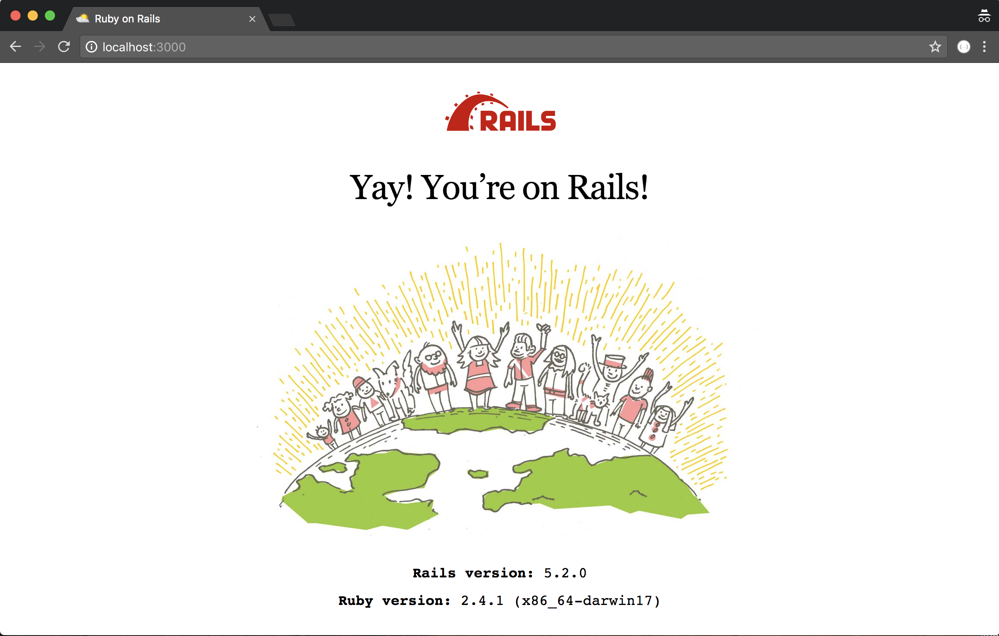

# Hello World!

* a thought
* another thought
* something profound

Note: This is where you put the notes that you only want yourself to see.

---

## A Big Image

Note: Anything you put in a header tag automatically becomes the slide's title

---?code=code/sample.rb&lang=ruby

@title[Sample Code Snippet]
@[3-5](This shows a public method.)
@[7-11](This shows a private method.)

Note: But you can also set the title manually

---?&color=#add9e4&survey=https://docs.google.com/forms/d/e/1FAIpQLSf2wZ75XCsCaqLa2h2ij4pG4jD-lkoqRz4_EXBIcAL1KIgB-w/viewform

@title[Sample Survey]
